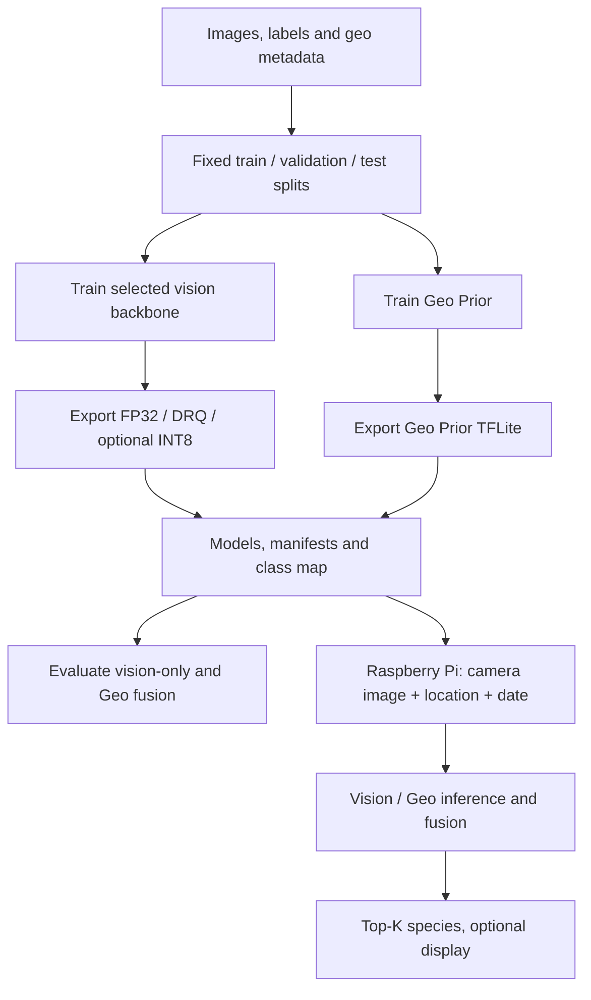

# Biodiversity Edge AI

**English** · [简体中文](README.zh-CN.md)

Offline species recognition with seven vision backbones, a spatio-temporal Geo Prior, TFLite quantization, and Raspberry Pi camera inference.

[Quick start](#quick-start) · [Dataset](#dataset) · [Training](#training) · [Evaluation](#evaluation) · [Raspberry Pi](#raspberry-pi) · [Results](#results) · [Architecture](#architecture)

## Quick start

Run from the repository root on macOS or Linux, with Python 3.10–3.12. Python 3.12 is the verified workstation version.

```bash
git clone https://github.com/winson5566/biodiversity-edge-ai.git
cd biodiversity-edge-ai
python3.12 -m venv .venv
source .venv/bin/activate
python -m pip install -c constraints-workstation.txt -e '.[train,dev]'
make smoke
```

This generates 24 images, trains both models without pretrained downloads, exports FP32/DRQ/full INT8, and evaluates each format with and without Geo fusion. Inspect `artifacts/runs/smoke-mobilenet-v2/results/tradeoffs.md`. Synthetic accuracy only checks pipeline execution.

`make test` runs the unit tests. `BIODIVERSITY_TF_TESTS=1 make test` also checks all seven backbones and matching training/device preprocessing.

## Dataset

The default is iNaturalist 2021 Train Mini: 500,000 images, 10,000 species. Full Train contains 2,686,843 images and uses the same workflow. Location and date fields are supplied in the [official annotation format](https://github.com/visipedia/inat_comp/tree/master/2021#annotation-format).

### Download and extract

Download the Mini image and annotation archives (about 42 GB + 45 MB):

```bash
mkdir -p raw/inat2021
cd raw/inat2021
curl -fL -C - -O https://ml-inat-competition-datasets.s3.amazonaws.com/2021/train_mini.tar.gz
curl -fL -C - -O https://ml-inat-competition-datasets.s3.amazonaws.com/2021/train_mini.json.tar.gz
# Linux: md5sum train_mini.tar.gz train_mini.json.tar.gz
# macOS: md5 train_mini.tar.gz train_mini.json.tar.gz
tar -xzf train_mini.tar.gz
tar -xzf train_mini.json.tar.gz
cd ../..
```

Verify MD5 **before extracting**: images `db6ed8330e634445efc8fec83ae81442`; annotations `395a35be3651d86dc3b0d365b8ea5f92`. Allow space for both archives and extracted images. Expected layout:

```text
raw/inat2021/
├── train_mini.json
└── train_mini/
    └── category/image.jpg
```

For Full Train, download and extract `train.tar.gz` and `train.json.tar.gz` into the same root, then use `DATA_SOURCE=full`.

<details>
<summary>All dataset downloads, hashes, and S3 locations</summary>

| File | Size | MD5 | S3 location |
|---|---:|---|---|
| [Train Mini images](https://ml-inat-competition-datasets.s3.amazonaws.com/2021/train_mini.tar.gz) | 42 GB | `db6ed8330e634445efc8fec83ae81442` | `s3://ml-inat-competition-datasets/2021/train_mini.tar.gz` |
| [Train Mini annotations](https://ml-inat-competition-datasets.s3.amazonaws.com/2021/train_mini.json.tar.gz) | 45 MB | `395a35be3651d86dc3b0d365b8ea5f92` | `s3://ml-inat-competition-datasets/2021/train_mini.json.tar.gz` |
| [Train images](https://ml-inat-competition-datasets.s3.amazonaws.com/2021/train.tar.gz) | 224 GB | `e0526d53c7f7b2e3167b2b43bb2690ed` | `s3://ml-inat-competition-datasets/2021/train.tar.gz` |
| [Train annotations](https://ml-inat-competition-datasets.s3.amazonaws.com/2021/train.json.tar.gz) | 221 MB | `38a7bb733f7a09214d44293460ec0021` | `s3://ml-inat-competition-datasets/2021/train.json.tar.gz` |
| [Validation images](https://ml-inat-competition-datasets.s3.amazonaws.com/2021/val.tar.gz) | 8.4 GB | `f6f6e0e242e3d4c9569ba56400938afc` | `s3://ml-inat-competition-datasets/2021/val.tar.gz` |
| [Validation annotations](https://ml-inat-competition-datasets.s3.amazonaws.com/2021/val.json.tar.gz) | 9.4 MB | `4d761e0f6a86cc63e8f7afc91f6a8f0b` | `s3://ml-inat-competition-datasets/2021/val.json.tar.gz` |
| [Public Test images](https://ml-inat-competition-datasets.s3.amazonaws.com/2021/public_test.tar.gz) | 43 GB | `7124b949fe79bfa7f7019a15ef3dbd06` | `s3://ml-inat-competition-datasets/2021/public_test.tar.gz` |
| [Public Test info](https://ml-inat-competition-datasets.s3.amazonaws.com/2021/public_test.json.tar.gz) | 21 MB | `7a9413db55c6fa452824469cc7dd9d3d` | `s3://ml-inat-competition-datasets/2021/public_test.json.tar.gz` |

Images are JPEG files with a maximum dimension of 500 pixels. Extraction creates `train_mini/category/image.jpg`, `train/category/image.jpg`, or `val/category/image.jpg`. Read the [official dataset page and terms](https://github.com/visipedia/inat_comp/tree/master/2021) before downloading.

</details>

### Prepare the experiment

```bash
make prepare CONFIG=configs/small_demo.json
```

The preparation step joins image IDs with category IDs, fixes a shared class order, validates image files, and creates approximately 70%/15%/15% train/validation/test splits (rounded per class). It writes:

```text
artifacts/runs/small-mobilenet-v2/dataset/
├── dataset_manifest.json
├── class_map.json
├── images/{train,val,test}/<class_id>/
└── metadata/{train,val,test}.csv
```

Images are symlinked; keep the extracted source in place and unchanged. Metadata CSVs contain `filename, image_id, source_category_id, label_id, class_name, latitude, longitude, date, valid, source_file`. Missing location/date is marked invalid. Geo training uses valid rows, while inference falls back to vision-only when metadata is unavailable.

The official Validation and Public Test archives are optional and are not automatically used by these presets. Public Test has no public labels for local accuracy.

## Training

### Choose a workload

| Workload | Command | Training source |
|---|---|---|
| Small subset | `make workstation CONFIG=configs/small_demo.json` | 10 classes, up to 50 images/class |
| Mini, default | `make workstation` | 10,000 classes, all usable Mini images |
| Full Train | `make workstation DATA_SOURCE=full` | 10,000 classes, all usable Full images |

Real-data runs download ImageNet weights on first use. The presets are runnable starting configurations, not the exact hyperparameters behind every reported result.

### Choose a model

```bash
make workstation CONFIG=configs/small_demo.json VISION_BACKBONE=efficientnet-b0
```

| Backbone option | External input preprocessing |
|---|---|
| `mobilenet-v2` | RGB scaled to [-1, 1] |
| `mobilenet-v3-large` | RGB [0, 255]; model includes preprocessing |
| `efficientnet-b0` | RGB [0, 255]; model includes preprocessing |
| `resnet-50`, `resnet-101` | RGB → BGR, subtract ImageNet channel means |
| `convnext-tiny`, `convnext-small` | RGB [0, 255]; model includes preprocessing |

Training, calibration and inference share the same center crop, bilinear resize and pixel scaling. Input contracts follow [Keras Applications](https://keras.io/api/applications/). Training saves the contract beside the Keras model; export inherits and checks it.

<details>
<summary>Run all seven models on the same small subset</summary>

```bash
for model in mobilenet-v2 mobilenet-v3-large efficientnet-b0 \
             resnet-50 resnet-101 convnext-tiny convnext-small; do
  make workstation CONFIG=configs/small_demo.json VISION_BACKBONE="$model" || exit 1
done
```

Each model receives its own directory and the same deterministic class selection and split. This runs seven separate training jobs; use a workstation with sufficient memory.

</details>

### Configure and resume

JSON presets in `configs/` are read directly by the workflow. Copy a preset and change epochs, input size, batch size, formats, threads or fusion weight. An explicit name gives the experiment a stable location:

```bash
PYTHONPATH=src python -m biodiversity_edge_ai.workflow \
  --config configs/small_demo.json --run my-experiment --dry-run
```

Remove `--dry-run` to execute. For external data, add `--annotations /data/train_mini.json --images-root /data`. Paths are relative to the repository working directory, not the JSON file.

Outputs are isolated under `artifacts/runs/<preset>-<backbone>/`, or `artifacts/runs/<run>/` with `RUN=my-experiment`. The directory records effective settings, source hashes, package versions, step logs, models and results. Repeating the same command reuses verified completed stages. Changed settings, source, environment or saved artifacts require a new run name. After an interrupted data extraction/preparation, use a new run name; source images are not re-downloaded.

## Quantization and export

```bash
make export CONFIG=configs/small_demo.json
```

Each stage runs its prerequisites. Standard presets export FP32 and dynamic-range quantization (DRQ); the smoke preset additionally checks full INT8. To request full INT8 for another experiment, add `"int8"` to its `formats` list and use a new run name. Calibration samples come only from training images. Operator support can vary by backbone; full INT8 has been pipeline-tested with MobileNetV2.

The deployable `models/` directory contains `class_map.json`, `vision_<format>.tflite`, `geo_prior_fp32.tflite`, and matching `.manifest.json` files. Keep models, manifests and class map together. Class-map hashes and output sizes must match for fusion.

## Evaluation

```bash
make benchmark CONFIG=configs/small_demo.json
```

The workflow benchmarks every selected format twice: vision-only and log-linear Geo fusion. Results include Top-1/Top-5, model bytes, load time, invocation and pipeline latency, throughput, optional RSS memory, and host details. Raw JSON plus CSV/Markdown comparisons are saved in `results/`.

Use validation data to choose `alpha` (default 0.3); reserve test data for the final comparison. Benchmark on the target Pi for device performance. Local workstation measurements are not Pi latency or battery measurements.

<details>
<summary>Benchmark exported models on the Pi</summary>

Copy a held-out image subset and its matching metadata CSV along with the model bundle. Then run:

```bash
python scripts/benchmark_rpi.py \
  --images evaluation/images --metadata-csv evaluation/test.csv \
  --vision-model models/vision_drq.tflite \
  --vision-manifest models/vision_drq.tflite.manifest.json \
  --geo-model models/geo_prior_fp32.tflite \
  --geo-manifest models/geo_prior_fp32.tflite.manifest.json \
  --class-map models/class_map.json --threads 4 \
  --warmup 10 --repetitions 5 --output results/pi-drq.json
```

For measured active-minus-idle power, add `--net-power-w <watts>` to derive energy per invocation and FPS/W. Battery duration requires a physical discharge test with a defined capture interval; it is not inferred from this benchmark. Keep thread count, data, warm-up and repetitions fixed when comparing formats.

</details>

## Raspberry Pi

| Component | Configuration |
|---|---|
| Compute | Raspberry Pi Zero 2 W — quad-core ARM Cortex-A53 at 1.0 GHz, 512 MB RAM; Raspberry Pi OS Lite 64-bit |
| Camera | Raspberry Pi CSI Sony IMX219, 8 MP |
| Display | 1.3-inch Waveshare IPS LCD (ST7789) |
| Location hardware | L76K GPS |
| Power | PiSugar 3 battery-management board with 1,200 mAh single-cell Li-ion battery |
| Storage | 32 GB microSD card |
| Bill of materials | NZ$158, excluding the custom enclosure and buttons |

The hardware configuration includes GPS. The current camera command accepts fixed `--latitude` and `--longitude`; live GPS acquisition is not implemented in this repository.

### Install and copy models

Use Raspberry Pi OS Lite 64-bit with Python 3.10–3.12 and a matching TFLite runtime wheel. For example, Raspberry Pi OS Bookworm uses Python 3.11. Follow the [TFLite Python runtime guide](https://www.tensorflow.org/lite/guide/python) if a wheel is unavailable for the installed Python/architecture.

On the Pi, clone the repository and run from its root:

```bash
sudo apt update
sudo apt install -y python3-venv python3-picamera2 python3-spidev python3-gpiozero
python3 -m venv --system-site-packages .venv
source .venv/bin/activate
python -m pip install -e '.[rpi]' tflite-runtime
```

Copy the contents of the workstation experiment's `models/` directory into `models/` on the Pi. Only the TFLite files, their manifests and `class_map.json` are needed. For the display, enable SPI and use the wiring declared in `device/waveshare/config.py`.

### Predict

```bash
python scripts/predict.py \
  --image /path/to/photo.jpg \
  --vision-model models/vision_drq.tflite \
  --vision-manifest models/vision_drq.tflite.manifest.json \
  --class-map models/class_map.json
```

For a camera capture with Geo fusion (replace the example coordinates with your location):

```bash
python scripts/rpi_camera.py \
  --vision-model models/vision_drq.tflite \
  --vision-manifest models/vision_drq.tflite.manifest.json \
  --class-map models/class_map.json \
  --geo-model models/geo_prior_fp32.tflite \
  --geo-manifest models/geo_prior_fp32.tflite.manifest.json \
  --latitude -43.5 --longitude 172.6 --threads 4
```

Add `--display` for ST7789 output. Image prediction with Geo fusion also requires `--date YYYY-MM-DD`; camera inference uses the Pi's current date. Camera arrays use the RGB byte order specified by [Picamera2](https://github.com/raspberrypi/picamera2/blob/main/picamera2/request.py). Camera and display operation require testing on the physical device.

## Results

Reference results below are transcribed from the project report (Tables 6, 7, 9, 11, 12 and 13). They cover seven trained vision architectures and their FP32/DRQ variants. Model size, training setup and evaluation split may differ from the supplied runnable presets.

### iNat2021 validation accuracy

| Model | FP32 Top-1 | FP32 Top-5 | DRQ Top-1 | DRQ Top-5 |
|---|---:|---:|---:|---:|
| EfficientNet-B0 | 73.77% | 89.39% | 70.84% | 87.60% |
| MobileNetV3-Large | 71.63% | 87.70% | 69.64% | 86.75% |
| MobileNetV2 | 68.62% | 86.25% | 68.31% | 86.14% |
| ResNet-50 | 75.61% | 90.63% | 75.50% | 90.54% |
| ResNet-101 | 77.85% | 91.89% | 77.80% | 91.85% |
| ConvNeXt-Tiny | 81.89% | 94.13% | 81.74% | 94.06% |
| ConvNeXt-Small | 83.33% | 94.81% | 83.29% | 94.78% |

For EfficientNet-B0, Geo Prior fusion with log-linear α = 0.3 raises Top-1 from 73.77% to 83.26% (FP32), and from 70.84% to 81.33% (DRQ).

### Battery life

Measured with a 30-second capture-infer-display cycle.

| Model | FP32 | DRQ |
|---|---:|---:|
| EfficientNet-B0 | 4.68 h | 4.55 h |
| MobileNetV3-Large | 4.66 h | 4.62 h |
| MobileNetV2 | 4.65 h | 4.60 h |
| ResNet-50 | — | 4.40 h |
| ResNet-101 | — | 4.25 h |
| ConvNeXt-Tiny | — | 3.93 h |
| ConvNeXt-Small | — | 3.70 h |

<details>
<summary>Model size and complexity</summary>

| Model | FP32 size | DRQ size | Parameters | FLOPs |
|---|---:|---:|---:|---:|
| EfficientNet-B0 | 64.07 MB | 16.15 MB | 16.80 M | 0.81 G |
| MobileNetV3-Large | 47.95 MB | 12.07 MB | 12.57 M | 0.61 G |
| MobileNetV2 | 57.28 MB | 14.41 MB | 15.02 M | 0.63 G |
| ResNet-50 | 167.74 MB | 42.04 MB | 43.97 M | 8.20 G |
| ResNet-101 | 240.09 MB | 60.20 MB | 62.94 M | 15.60 G |
| ConvNeXt-Tiny | 135.44 MB | 34.05 MB | 35.50 M | 9.00 G |
| ConvNeXt-Small | 217.94 MB | 54.84 MB | 58.13 M | 17.40 G |

</details>

<details>
<summary>Pi Zero 2 W latency and throughput</summary>

Each entry is mean latency in milliseconds / FPS. `—` means that format was not measured on the device.

| Model | FP32, 1 thread | FP32, 4 threads | DRQ, 1 thread | DRQ, 4 threads |
|---|---:|---:|---:|---:|
| EfficientNet-B0 | 903.95 / 1.11 | 753.08 / 1.33 | 626.26 / 1.60 | 461.50 / 2.17 |
| MobileNetV3-Large | 224.87 / 4.45 | 116.28 / 8.60 | 239.81 / 4.17 | 205.18 / 4.87 |
| MobileNetV2 | 221.25 / 4.52 | 114.18 / 8.76 | 311.95 / 3.21 | 182.61 / 5.48 |
| ResNet-50 | — | — | 1,731.15 / 0.58 | 653.47 / 1.53 |
| ResNet-101 | — | — | 3,213.36 / 0.31 | 1,192.17 / 0.84 |
| ConvNeXt-Tiny | — | — | 6,484.90 / 0.15 | 5,243.91 / 0.19 |
| ConvNeXt-Small | — | — | 11,302.33 / 0.09 | 10,884.12 / 0.09 |

</details>

<details>
<summary>Energy per inference and FPS/W</summary>

Derived from measured throughput with four inference threads and net inference power of 1.5 W (2.5 W active minus 1.0 W idle).

| Model | FP32 mJ | FP32 FPS/W | DRQ mJ | DRQ FPS/W |
|---|---:|---:|---:|---:|
| EfficientNet-B0 | 1,127.8 mJ | 0.89 | 691.2 mJ | 1.45 |
| MobileNetV3-Large | 174.4 mJ | 5.73 | 308.0 mJ | 3.25 |
| MobileNetV2 | 171.2 mJ | 5.84 | 273.7 mJ | 3.65 |
| ResNet-50 | — | — | 980.4 mJ | 1.02 |
| ResNet-101 | — | — | 1,785.7 mJ | 0.56 |
| ConvNeXt-Tiny | — | — | 7,894.7 mJ | 0.13 |
| ConvNeXt-Small | — | — | 16,666.7 mJ | 0.06 |

</details>


## Architecture

### Code layout

```text
src/biodiversity_edge_ai/
├── workflow.py       configured experiment stages and resume checks
├── config.py         validated experiment settings
├── data/             image/metadata preparation and synthetic test data
├── models/           seven vision backbones, input contracts, Geo Prior
├── training/         vision and Geo Prior training
├── export/           TFLite conversion and calibration
├── evaluation/       benchmarks and comparison tables
├── device/           image CLI, Pi camera, ST7789 display
├── metadata.py       longitude/latitude/date feature encoding
├── manifest.py       model contracts and compatibility checks
├── inference.py      image preprocessing and TFLite runtime
├── fusion.py         Bayesian and log-linear fusion
└── pipeline.py       shared prediction pipeline

configs/              Mini, Full, small-subset and smoke presets
scripts/              individual command-line entry points
tests/                unit and optional TensorFlow integration tests
Makefile              short commands for workflow stages
```

### Workflow


