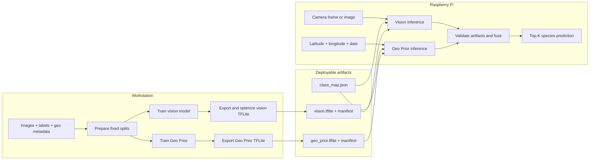

# Biodiversity Edge AI

**English** · [简体中文](README.zh-CN.md)

An offline species-recognition system for Raspberry Pi. It trains an image classifier and a spatio-temporal Geo Prior, exports TFLite models, evaluates quantization and pruning, and runs camera inference on-device.

## Quick start

Use Python 3.10–3.12; Python 3.12 is recommended.

```bash
git clone https://github.com/winson5566/biodiversity-edge-ai.git
cd biodiversity-edge-ai
python3.12 -m venv .venv
source .venv/bin/activate
python -m pip install -e '.[train,dev]'
make smoke
```

`make smoke` needs no download. It creates 24 synthetic images, trains both models, exports FP32/DRQ/INT8 variants, applies 50% pruning, and writes a comparison table to `artifacts/smoke/results/tradeoffs.md`.

## Dataset

The default source is **iNaturalist 2021 Train Mini**: 500,000 images across 10,000 species. Full Train uses the same pipeline.

| Mode | Download | Run |
|---|---:|---|
| Mini (default) | 42 GB images + 45 MB annotations | `make workstation` |
| Full Train | 224 GB images + 221 MB annotations | `make workstation DATA_SOURCE=full` |

Download the Mini pair, verify it, and extract it into `raw/inat2021`:

```bash
mkdir -p raw/inat2021 && cd raw/inat2021
curl -C - -O https://ml-inat-competition-datasets.s3.amazonaws.com/2021/train_mini.tar.gz
curl -C - -O https://ml-inat-competition-datasets.s3.amazonaws.com/2021/train_mini.json.tar.gz
md5sum train_mini.tar.gz train_mini.json.tar.gz
tar -xzf train_mini.tar.gz
tar -xzf train_mini.json.tar.gz
cd ../..
```

Expected Mini MD5 values are `db6ed8330e634445efc8fec83ae81442` and `395a35be3651d86dc3b0d365b8ea5f92`. On macOS, use `md5` in place of `md5sum`.

<details>
<summary>All dataset downloads, hashes, and S3 locations</summary>

| File | Size | MD5 | S3 location |
|---|---:|---|---|
| [Train Mini images](https://ml-inat-competition-datasets.s3.amazonaws.com/2021/train_mini.tar.gz) | 42 GB | `db6ed8330e634445efc8fec83ae81442` | `s3://ml-inat-competition-datasets/2021/train_mini.tar.gz` |
| [Train Mini annotations](https://ml-inat-competition-datasets.s3.amazonaws.com/2021/train_mini.json.tar.gz) | 45 MB | `395a35be3651d86dc3b0d365b8ea5f92` | `s3://ml-inat-competition-datasets/2021/train_mini.json.tar.gz` |
| [Train images](https://ml-inat-competition-datasets.s3.amazonaws.com/2021/train.tar.gz) | 224 GB | `e0526d53c7f7b2e3167b2b43bb2690ed` | `s3://ml-inat-competition-datasets/2021/train.tar.gz` |
| [Train annotations](https://ml-inat-competition-datasets.s3.amazonaws.com/2021/train.json.tar.gz) | 221 MB | `38a7bb733f7a09214d44293460ec0021` | `s3://ml-inat-competition-datasets/2021/train.json.tar.gz` |
| [Validation images](https://ml-inat-competition-datasets.s3.amazonaws.com/2021/val.tar.gz) | 8.4 GB | `f6f6e0e242e3d4c9569ba56400938afc` | `s3://ml-inat-competition-datasets/2021/val.tar.gz` |
| [Validation annotations](https://ml-inat-competition-datasets.s3.amazonaws.com/2021/val.json.tar.gz) | 9.4 MB | `4d761e0f6a86cc63e8f7afc91f6a8f0b` | `s3://ml-inat-competition-datasets/2021/val.json.tar.gz` |
| [Public Test images](https://ml-inat-competition-datasets.s3.amazonaws.com/2021/public_test.tar.gz) | 43 GB | `7124b949fe79bfa7f7019a15ef3dbd06` | `s3://ml-inat-competition-datasets/2021/public_test.tar.gz` |
| [Public Test info](https://ml-inat-competition-datasets.s3.amazonaws.com/2021/public_test.json.tar.gz) | 21 MB | `7a9413db55c6fa452824469cc7dd9d3d` | `s3://ml-inat-competition-datasets/2021/public_test.json.tar.gz` |

Images are JPEG files with a maximum dimension of 500 pixels. Extraction creates `train_mini/category/image.jpg`, `train/category/image.jpg`, or `val/category/image.jpg`. Read the [official dataset page and terms](https://github.com/visipedia/inat_comp/tree/master/2021) before downloading.

</details>

The standard pipeline makes a deterministic 70%/15%/15% split from the selected training source. It does not automatically use the official Validation or public Test downloads. Public Test has no labels, so it cannot calculate local accuracy.

## Train and export

Run the complete Mini workflow:

```bash
make workstation
```

This prepares data, trains MobileNetV2 and the six-feature Geo Prior, exports TFLite models, prunes the vision model, and creates benchmark tables.

Use a small live-demo subset:

```bash
make workstation NUM_CLASSES=10 MAX_PER_CLASS=50 \
  DATASET=data/prepared_demo \
  MODEL_DIR=artifacts/models_demo RESULT_DIR=artifacts/results_demo
```

| Stage | Command | Main output |
|---|---|---|
| Prepare | `make prepare` | fixed splits, metadata CSVs, `class_map.json` |
| Train | `make train` | `vision_baseline.keras`, `geo_prior.keras` |
| Export | `make export` | FP32, DRQ, INT8, and Geo Prior TFLite |
| Prune | `make optimize` | 50% pruned DRQ TFLite |
| Compare | `make benchmark` | JSON, CSV, and Markdown trade-off tables |

## Architecture



Fusion requires matching class-map hashes and output dimensions. Missing location or date uses vision-only inference.

## Evaluate and deploy

Benchmark the standard variants on the same held-out images:

```bash
make benchmark
```

Compare FP32, DRQ, full INT8, and pruned DRQ by Top-1 accuracy, model size, invocation latency, end-to-end latency, memory, and energy. Keep the split, preprocessing, Geo Prior, fusion weight, Pi configuration, thread count, warm-up, and repetitions unchanged across runs.

Predict one image:

```bash
PYTHONPATH=src python scripts/predict.py \
  --image /path/to/photo.jpg \
  --vision-model artifacts/models/vision_drq.tflite \
  --vision-manifest artifacts/models/vision_drq.tflite.manifest.json \
  --class-map data/prepared/class_map.json
```

For a Raspberry Pi camera, install PiCamera2, GPIO/SPI support, this project's `.[rpi]` dependencies, and a compatible TensorFlow Lite Runtime. Then run:

```bash
PYTHONPATH=src python scripts/rpi_camera.py \
  --vision-model artifacts/models/vision_drq.tflite \
  --vision-manifest artifacts/models/vision_drq.tflite.manifest.json \
  --class-map data/prepared/class_map.json
```

Add `--display` for ST7789 output. Add `--geo-model`, `--geo-manifest`, `--latitude`, and `--longitude` for Geo Prior fusion.

<details>
<summary>Verified smoke run and teaching use</summary>

The smoke workflow was executed on 8 September 2026 with Python 3.12.8, TensorFlow 2.16.2, Keras 3.8.0, and an Apple M4 workstation. It completed data preparation, both training paths, FP32/DRQ/INT8 conversion, 50% pruning, fused inference, and trade-off generation.

| Variant | Model bytes | Synthetic Top-1 | End-to-end median |
|---|---:|---:|---:|
| FP32 | 2,761,512 | 50% | 0.263 ms |
| DRQ | 870,752 | 50% | 0.237 ms |
| Full INT8 | 973,752 | 50% | 0.192 ms |
| Pruned 50% + DRQ | 862,096 | 50% | 0.230 ms |

These are four-image workstation checks, not real-data or Pi results. For a 60–90 minute session, use a 5–10 class subset, compare the four model variants, then justify a deployment choice from measured accuracy, size, latency, memory, and energy.

</details>

Run the core tests with `make test`.
