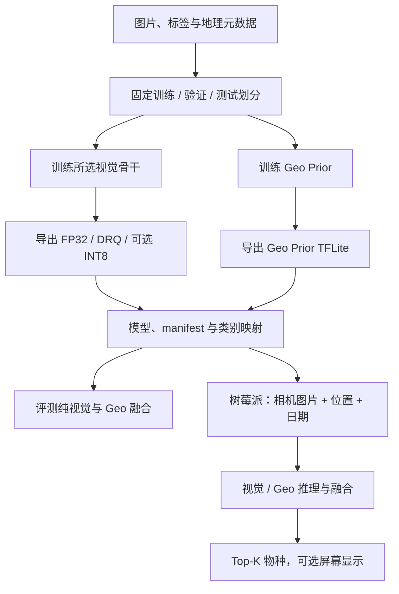

# Biodiversity Edge AI

[English](README.md) · **简体中文**

离线物种识别系统，支持七种视觉骨干模型、时空 Geo Prior、TFLite 量化和树莓派相机推理。

[快速开始](#快速开始) · [数据集](#数据集) · [训练](#训练) · [评测](#评测) · [树莓派部署](#树莓派部署) · [实验结果](#实验结果) · [代码架构](#代码架构)

## 快速开始

在 macOS 或 Linux 的仓库根目录执行，支持 Python 3.10–3.12。工作站验证版本为 Python 3.12。

```bash
git clone https://github.com/winson5566/biodiversity-edge-ai.git
cd biodiversity-edge-ai
python3.12 -m venv .venv
source .venv/bin/activate
python -m pip install -c constraints-workstation.txt -e '.[train,dev]'
make smoke
```

该命令生成 24 张图片，无需下载预训练权重，完成三阶段视觉训练、Geo Prior 训练、FP32/DRQ/全 INT8 导出，以及各格式的纯视觉和 Geo 融合评测。结果位于 `artifacts/runs/smoke-mobilenet-v2/results/tradeoffs.md`。合成数据准确率仅用于检查流程执行。

`make test` 运行单元测试；`BIODIVERSITY_TF_TESTS=1 make test` 还会检查七种骨干模型，以及训练和设备端预处理的一致性。

## 数据集

默认使用 iNaturalist 2021 Train Mini：500,000 张图片、10,000 个物种。全量 Train 有 2,686,843 张图片，使用同一运行流程。位置和日期字段见[官方标注格式](https://github.com/visipedia/inat_comp/tree/master/2021#annotation-format)。

### 下载与解压

下载 Mini 图片和标注压缩包（约 42 GB + 45 MB）：

```bash
mkdir -p raw/inat2021
cd raw/inat2021
curl -fL -C - -O https://ml-inat-competition-datasets.s3.amazonaws.com/2021/train_mini.tar.gz
curl -fL -C - -O https://ml-inat-competition-datasets.s3.amazonaws.com/2021/train_mini.json.tar.gz
# Linux: md5sum train_mini.tar.gz train_mini.json.tar.gz
# macOS: md5 train_mini.tar.gz train_mini.json.tar.gz
tar -xzf train_mini.tar.gz
tar -xzf train_mini.json.tar.gz
cd ../..
```

请在**解压前核对 MD5**：图片 `db6ed8330e634445efc8fec83ae81442`，标注 `395a35be3651d86dc3b0d365b8ea5f92`。磁盘需同时容纳压缩包和解压后的图片。预期目录：

```text
raw/inat2021/
├── train_mini.json
└── train_mini/
    └── category/image.jpg
```

使用全量数据时，将 `train.tar.gz` 和 `train.json.tar.gz` 下载、解压到同一根目录，再设置 `DATA_SOURCE=full`。

<details>
<summary>全部数据下载、哈希和 S3 地址</summary>

| 文件 | 大小 | MD5 | S3 地址 |
|---|---:|---|---|
| [Train Mini 图片](https://ml-inat-competition-datasets.s3.amazonaws.com/2021/train_mini.tar.gz) | 42 GB | `db6ed8330e634445efc8fec83ae81442` | `s3://ml-inat-competition-datasets/2021/train_mini.tar.gz` |
| [Train Mini 标注](https://ml-inat-competition-datasets.s3.amazonaws.com/2021/train_mini.json.tar.gz) | 45 MB | `395a35be3651d86dc3b0d365b8ea5f92` | `s3://ml-inat-competition-datasets/2021/train_mini.json.tar.gz` |
| [全量 Train 图片](https://ml-inat-competition-datasets.s3.amazonaws.com/2021/train.tar.gz) | 224 GB | `e0526d53c7f7b2e3167b2b43bb2690ed` | `s3://ml-inat-competition-datasets/2021/train.tar.gz` |
| [全量 Train 标注](https://ml-inat-competition-datasets.s3.amazonaws.com/2021/train.json.tar.gz) | 221 MB | `38a7bb733f7a09214d44293460ec0021` | `s3://ml-inat-competition-datasets/2021/train.json.tar.gz` |
| [Validation 图片](https://ml-inat-competition-datasets.s3.amazonaws.com/2021/val.tar.gz) | 8.4 GB | `f6f6e0e242e3d4c9569ba56400938afc` | `s3://ml-inat-competition-datasets/2021/val.tar.gz` |
| [Validation 标注](https://ml-inat-competition-datasets.s3.amazonaws.com/2021/val.json.tar.gz) | 9.4 MB | `4d761e0f6a86cc63e8f7afc91f6a8f0b` | `s3://ml-inat-competition-datasets/2021/val.json.tar.gz` |
| [Public Test 图片](https://ml-inat-competition-datasets.s3.amazonaws.com/2021/public_test.tar.gz) | 43 GB | `7124b949fe79bfa7f7019a15ef3dbd06` | `s3://ml-inat-competition-datasets/2021/public_test.tar.gz` |
| [Public Test 信息](https://ml-inat-competition-datasets.s3.amazonaws.com/2021/public_test.json.tar.gz) | 21 MB | `7a9413db55c6fa452824469cc7dd9d3d` | `s3://ml-inat-competition-datasets/2021/public_test.json.tar.gz` |

图片均为最长边 500 像素的 JPEG。解压后分别产生 `train_mini/category/image.jpg`、`train/category/image.jpg` 或 `val/category/image.jpg`。下载前请阅读[官方数据说明与使用条款](https://github.com/visipedia/inat_comp/tree/master/2021)。

</details>

### 准备实验数据

```bash
make prepare CONFIG=configs/small_demo.json
```

数据准备按图片 ID 关联类别，固定共享类别顺序，验证图片文件，并生成约 70%/15%/15% 的训练/验证/测试划分（逐类取整）。输出：

```text
artifacts/runs/small-mobilenet-v2/dataset/
├── dataset_manifest.json
├── class_map.json
├── images/{train,val,test}/<class_id>/
└── metadata/{train,val,test}.csv
```

图片通过符号链接引用原始数据，因此解压目录应保持原位，原始图片应保持不变。元数据 CSV 包含 `filename, image_id, source_category_id, label_id, class_name, latitude, longitude, date, valid, source_file`。缺少位置或日期时标记为无效；Geo 训练仅使用有效行，推理时缺少元数据则回退到纯视觉。

官方 Validation 和 Public Test 为可选下载，本项目配置不会自动使用它们。Public Test 不提供可用于本地准确率计算的公开标签。

## 训练

### 选择数据规模

| 规模 | 命令 | 训练源 |
|---|---|---|
| 小样本 | `make workstation CONFIG=configs/small_demo.json` | 10 类，每类最多 50 张 |
| Mini，默认 | `make workstation` | 10,000 类，使用全部可用 Mini 图片 |
| 全量 Train | `make workstation DATA_SOURCE=full` | 10,000 类，使用全部可用全量图片 |

从头训练的实验首次运行会下载 ImageNet 权重。默认模型为 EfficientNet-B0；保存的 MobileNetV2 配置需要已有检查点。

### 选择模型配置

恢复的配置采用三阶段训练：分类头训练、全模型微调、最后 N 层的高分辨率微调。下表来自保存的训练配置文件，不是统一套用的调参建议。

| 模型配置 | 轮数：分类头 / 全模型 / 高分辨率 | 输入像素 | Batch | 最后 N 层 | RandAugment N / M |
|---|---|---|---|---|---|
| [EfficientNet-B0](configs/models/efficientnet-b0.json) — 默认 | 5 / 10 / 5 | 224 → 300 | 32 | 18 | 2 / 2 |
| [MobileNetV3-Large](configs/models/mobilenet-v3-large.json) | 4 / 10 / 3 | 224 → 300 | 32 | 10 | 3 / 2 |
| [ResNet50](configs/models/resnet-50.json) | 3 / 10 / 3 | 224 → 300 | 32 | 18 | 2 / 2 |
| [ResNet101](configs/models/resnet-101.json) | 3 / 10 / 3 | 224 → 300 | 32 | 18 | 2 / 2 |
| [ConvNeXt-Small](configs/models/convnext-small.json) | 3 / 10 / 3 | 224 → 300 | 32 | 18 | 2 / 2 |
| [MobileNetV2](configs/models/mobilenet-v2.json) — 仅续训 | 0 / 0 / 2 | 300 | 32 | 18 | 第三阶段不启用 |
| [ConvNeXt-Tiny](configs/models/convnext-tiny.json) | 未找到配置 | — | — | — | — |

共同参数：SGD、momentum 0.9、label smoothing 0.1、随机种子 42；三阶段学习率为 0.1 / 0.1 / 0.008，按 `batch_size / 256` 缩放，batch 32 时实际为 **0.0125 / 0.0125 / 0.001**。脚本默认启用余弦衰减和 0.3 轮预热，每阶段重新开始。前两阶段使用随机裁剪、翻转和 RandAugment，第三阶段使用评测预处理。

Geo Prior 使用 Adam，batch 1024，初始学习率 0.0005，每轮乘 0.98，训练 30 轮，嵌入维度 256。按训练脚本默认值，各类别采样权重最多计入 100 条观测。视觉与地理模型的 batch 独立设置。

```bash
make workstation CONFIG=configs/models/efficientnet-b0.json
make workstation CONFIG=configs/models/efficientnet-b0.json DATA_SOURCE=full
```

**MobileNetV2 恢复的是续训配置，不是从头训练配置。** 保存的命令会加载已有权重。必须同时提供兼容权重和按输出顺序排列的 JSON 类名列表，类别顺序不一致时会拒绝运行：

```bash
make workstation CONFIG=configs/models/mobilenet-v2.json \
  INITIAL_WEIGHTS=/data/ckp.weights.h5 INITIAL_CLASS_MAP=/data/class_map.json
```

ConvNeXt-Tiny 的模型架构仍受支持，但未找到对应训练配置。其文件仅记录缺失状态（`recipe_status: "missing"`），不能直接启动训练。补充原始配置，或自行填写完整参数后显式改为 `recipe_status: "custom"`；自行确定的参数不属于已恢复的参数。

<details>
<summary>参数依据与复现边界</summary>

每份恢复的 JSON 在 `parameter_source` 中记录参考配置与哈希；六份保存的参数文件保留在 [configs/reference](configs/reference)。显式配置值与训练脚本默认值分开记录。

以下调整是明确保留的差异：

- 数据默认仍为 Mini。保存的文件名虽然含有“inatmini”，样本数却写的是 2,686,843（全量 Train）；新流程根据实际准备的数据统计样本，并使用自身的确定性划分。
- 输入归一化遵循各 Keras 骨干：MobileNetV2 为 [-1, 1]，ResNet 为 BGR／ImageNet 均值处理，EfficientNet、MobileNetV3、ConvNeXt 为 [0, 255]。保存的配置对所有模型均写了 uint8。
- 第三阶段训练后的 300 像素输入会保留到导出与推理。保存的导出参数写的是 224，本流程不会在训练后悄悄改变尺寸。
- 显式解冻骨干最后 N 层。保存的构建器仍将父级骨干设为冻结，无法可靠地让这些参数参与训练。
- 保留 Geo 类别权重和学习率衰减；类别内循环打乱、类别抽样由 NumPy 生成，随机序列不同。
- 评测、校准和第三阶段训练共用设备端的中心裁剪／双线性缩放；前两阶段使用训练增强。

这些配置恢复的是参数与训练意图，不代表报告结果已被重新复现。RandAugment 保留 [Apache-2.0 许可声明](licenses/RandAugment-LICENSE.txt)。

</details>

### 配置与继续运行

小样本可使用 `configs/small_demo.json`（简化的 MobileNetV2），或复制一个可从头训练的模型配置，设置 `recipe_status: "custom"`、独立 `name`、`num_classes: 10`、`min_per_class: 20`、`max_per_class: 50`，三个视觉阶段各 1 轮、`geo_epochs: 3`。将 `geo_batch_size` 降为 32，确保小样本能组成完整 batch。`configs/smoke.json` 使用 24 张合成图片、32 → 40 像素检查全部三阶段，它是流程测试，不是恢复出的 MobileNetV2 原始配置。`configs/mini.json` 和 `configs/full_system.json` 保留为 EfficientNet-B0 配置的兼容入口。

训练前可先检查实际执行的命令：

```bash
PYTHONPATH=src python -m biodiversity_edge_ai.workflow \
  --config configs/models/resnet-50.json --run my-experiment --dry-run
```

移除 `--dry-run` 即执行。追加 `--data-source full`（或 Make 的 `DATA_SOURCE=full`）只切换标注数据源，不改变模型训练或子集参数；未指定时保留 JSON 的数据源。外部数据可追加 `--annotations /data/train_mini.json --images-root /data`，显式路径优先。相对路径以仓库工作目录为基准，不以 JSON 所在目录为基准。

输出隔离在 `artifacts/runs/<配置名>-<骨干模型>/`；使用 `RUN=my-experiment` 时为 `artifacts/runs/<实验名>/`。目录记录实际配置、源码哈希、依赖版本、分步日志、模型和结果；分阶段训练记录包括实际学习率、输入尺寸和可训练变量数量。重复相同命令会复用已验证完成的流程步骤；更改配置、源码、环境或已保存产物时，需要新实验名。数据解压或准备中断后，请使用新实验名；不会重新下载原始图片。

## 量化与导出

```bash
make export CONFIG=configs/small_demo.json
```

各阶段会自动执行前置步骤。标准配置导出 FP32 和动态范围量化（DRQ）；smoke 配置额外检查全 INT8。其他实验需要全 INT8 时，在配置的 `formats` 中加入 `"int8"` 并使用新实验名。校准样本仅取自训练图片。不同骨干的算子支持可能不同，目前全 INT8 已通过 MobileNetV2 完整流程检查。

可部署的 `models/` 目录包含 `class_map.json`、`vision_<格式>.tflite`、`geo_prior_fp32.tflite` 及对应的 `.manifest.json`。模型、manifest 和类别映射应一起复制；融合要求类别映射哈希和输出维度一致。

## 评测

```bash
make benchmark CONFIG=configs/small_demo.json
```

流程对每种导出格式分别执行纯视觉和 log-linear Geo 融合评测，记录 Top-1/Top-5、模型字节数、加载时间、模型调用和预测流程耗时、吞吐量、可选 RSS 内存及主机信息。原始 JSON 和 CSV/Markdown 对比表保存在 `results/`。

使用验证集选择 `alpha`（默认 0.3），保留测试集用于最终比较。设备性能应在目标树莓派上评测，工作站结果不能代表树莓派延迟或电池续航。

<details>
<summary>在树莓派上评测导出的模型</summary>

将保留测试图片子集及配套元数据 CSV 和模型一起复制，然后执行：

```bash
python scripts/benchmark_rpi.py \
  --images evaluation/images --metadata-csv evaluation/test.csv \
  --vision-model models/vision_drq.tflite \
  --vision-manifest models/vision_drq.tflite.manifest.json \
  --geo-model models/geo_prior_fp32.tflite \
  --geo-manifest models/geo_prior_fp32.tflite.manifest.json \
  --class-map models/class_map.json --threads 4 \
  --warmup 10 --repetitions 5 --output results/pi-drq.json
```

若已测量设备活动功耗减去空闲功耗的差值，可追加 `--net-power-w <瓦数>`，计算单次模型调用能耗和 FPS/W。续航需要在明确采集间隔下进行实机放电测试，本基准程序不会推算续航。比较模型时保持线程数、数据、预热和重复次数一致。

</details>

## 树莓派部署

| 部件 | 配置 |
|---|---|
| 计算单元 | Raspberry Pi Zero 2 W：四核 ARM Cortex-A53，1.0 GHz，512 MB RAM；Raspberry Pi OS Lite 64-bit |
| 相机 | Raspberry Pi CSI Sony IMX219，8 MP |
| 显示器 | 1.3 英寸 Waveshare IPS LCD（ST7789） |
| 定位硬件 | L76K GPS |
| 供电 | PiSugar 3 电池管理板，1,200 mAh 单节锂离子电池 |
| 存储 | 32 GB microSD 卡 |
| 物料成本 | NZ$158，不含定制外壳和按键 |

报告的硬件配置含 GPS。当前相机命令接收固定的 `--latitude` 和 `--longitude`；本仓库尚未实现实时 GPS 读取。

### 安装与复制模型

使用 Raspberry Pi OS Lite 64-bit、Python 3.10–3.12，以及匹配的 TFLite runtime wheel。例如 Raspberry Pi OS Bookworm 使用 Python 3.11。若当前 Python/架构没有对应 wheel，请参考 [TFLite Python 运行时指南](https://www.tensorflow.org/lite/guide/python)。

在树莓派上克隆仓库，并在仓库根目录执行：

```bash
sudo apt update
sudo apt install -y python3-venv python3-picamera2 python3-spidev python3-gpiozero
python3 -m venv --system-site-packages .venv
source .venv/bin/activate
python -m pip install -e '.[rpi]' tflite-runtime
```

将工作站实验 `models/` 内的部署文件复制到树莓派仓库中的 `models/`。仅需 TFLite 文件、对应 manifest 和 `class_map.json`。使用屏幕时启用 SPI，并按 `device/waveshare/config.py` 中的定义接线。

### 识别

```bash
python scripts/predict.py \
  --image /path/to/photo.jpg \
  --vision-model models/vision_drq.tflite \
  --vision-manifest models/vision_drq.tflite.manifest.json \
  --class-map models/class_map.json
```

相机采集并使用 Geo 融合（将示例坐标替换为实际位置）：

```bash
python scripts/rpi_camera.py \
  --vision-model models/vision_drq.tflite \
  --vision-manifest models/vision_drq.tflite.manifest.json \
  --class-map models/class_map.json \
  --geo-model models/geo_prior_fp32.tflite \
  --geo-manifest models/geo_prior_fp32.tflite.manifest.json \
  --latitude -43.5 --longitude 172.6 --threads 4
```

追加 `--display` 使用 ST7789 屏幕。图片识别使用 Geo 融合时还需 `--date YYYY-MM-DD`；相机识别使用树莓派当前日期。相机数组按 [Picamera2](https://github.com/raspberrypi/picamera2/blob/main/picamera2/request.py) 的约定采用 RGB 字节顺序。相机与屏幕运行需要在实机上验证。

## 实验结果

以下参考结果录自项目报告表 6、7、9、11、12、13，涵盖七种已训练视觉模型及 FP32/DRQ 版本。其模型大小、训练设置和评测划分可能与本仓库的运行配置不同。

### iNat2021 验证集准确率

| 模型 | FP32 Top-1 | FP32 Top-5 | DRQ Top-1 | DRQ Top-5 |
|---|---:|---:|---:|---:|
| EfficientNet-B0 | 73.77% | 89.39% | 70.84% | 87.60% |
| MobileNetV3-Large | 71.63% | 87.70% | 69.64% | 86.75% |
| MobileNetV2 | 68.62% | 86.25% | 68.31% | 86.14% |
| ResNet-50 | 75.61% | 90.63% | 75.50% | 90.54% |
| ResNet-101 | 77.85% | 91.89% | 77.80% | 91.85% |
| ConvNeXt-Tiny | 81.89% | 94.13% | 81.74% | 94.06% |
| ConvNeXt-Small | 83.33% | 94.81% | 83.29% | 94.78% |

EfficientNet-B0 使用 log-linear α = 0.3 的 Geo Prior 融合后，FP32 Top-1 从 73.77% 提升至 83.26%，DRQ Top-1 从 70.84% 提升至 81.33%。

### 电池续航

每 30 秒执行一次采集-推理-显示周期的实测续航。

| 模型 | FP32 | DRQ |
|---|---:|---:|
| EfficientNet-B0 | 4.68 h | 4.55 h |
| MobileNetV3-Large | 4.66 h | 4.62 h |
| MobileNetV2 | 4.65 h | 4.60 h |
| ResNet-50 | — | 4.40 h |
| ResNet-101 | — | 4.25 h |
| ConvNeXt-Tiny | — | 3.93 h |
| ConvNeXt-Small | — | 3.70 h |

<details>
<summary>模型大小与复杂度</summary>

| 模型 | FP32 大小 | DRQ 大小 | 参数量 | FLOPs |
|---|---:|---:|---:|---:|
| EfficientNet-B0 | 64.07 MB | 16.15 MB | 16.80 M | 0.81 G |
| MobileNetV3-Large | 47.95 MB | 12.07 MB | 12.57 M | 0.61 G |
| MobileNetV2 | 57.28 MB | 14.41 MB | 15.02 M | 0.63 G |
| ResNet-50 | 167.74 MB | 42.04 MB | 43.97 M | 8.20 G |
| ResNet-101 | 240.09 MB | 60.20 MB | 62.94 M | 15.60 G |
| ConvNeXt-Tiny | 135.44 MB | 34.05 MB | 35.50 M | 9.00 G |
| ConvNeXt-Small | 217.94 MB | 54.84 MB | 58.13 M | 17.40 G |

</details>

<details>
<summary>Pi Zero 2 W 延迟与吞吐</summary>

每个单元格均为平均延迟（ms）/ FPS。`—` 表示该格式未在设备上测量。

| 模型 | FP32，1 线程 | FP32，4 线程 | DRQ，1 线程 | DRQ，4 线程 |
|---|---:|---:|---:|---:|
| EfficientNet-B0 | 903.95 / 1.11 | 753.08 / 1.33 | 626.26 / 1.60 | 461.50 / 2.17 |
| MobileNetV3-Large | 224.87 / 4.45 | 116.28 / 8.60 | 239.81 / 4.17 | 205.18 / 4.87 |
| MobileNetV2 | 221.25 / 4.52 | 114.18 / 8.76 | 311.95 / 3.21 | 182.61 / 5.48 |
| ResNet-50 | — | — | 1,731.15 / 0.58 | 653.47 / 1.53 |
| ResNet-101 | — | — | 3,213.36 / 0.31 | 1,192.17 / 0.84 |
| ConvNeXt-Tiny | — | — | 6,484.90 / 0.15 | 5,243.91 / 0.19 |
| ConvNeXt-Small | — | — | 11,302.33 / 0.09 | 10,884.12 / 0.09 |

</details>

<details>
<summary>单次推理能耗与 FPS/W</summary>

根据 4 线程实测吞吐量和 1.5 W 净推理功耗计算（活动功耗 2.5 W 减去空闲功耗 1.0 W）。

| 模型 | FP32 mJ | FP32 FPS/W | DRQ mJ | DRQ FPS/W |
|---|---:|---:|---:|---:|
| EfficientNet-B0 | 1,127.8 mJ | 0.89 | 691.2 mJ | 1.45 |
| MobileNetV3-Large | 174.4 mJ | 5.73 | 308.0 mJ | 3.25 |
| MobileNetV2 | 171.2 mJ | 5.84 | 273.7 mJ | 3.65 |
| ResNet-50 | — | — | 980.4 mJ | 1.02 |
| ResNet-101 | — | — | 1,785.7 mJ | 0.56 |
| ConvNeXt-Tiny | — | — | 7,894.7 mJ | 0.13 |
| ConvNeXt-Small | — | — | 16,666.7 mJ | 0.06 |

</details>


## 代码架构

### 目录结构

```text
src/biodiversity_edge_ai/
├── workflow.py       配置驱动的实验步骤与继续运行检查
├── config.py         实验配置与校验
├── data/             图片/元数据准备和合成测试数据
├── models/           七种视觉骨干、输入约定、Geo Prior
├── training/         视觉模型和 Geo Prior 训练
├── export/           TFLite 转换与量化校准
├── evaluation/       基准测试与对比表
├── device/           图片命令行、树莓派相机、ST7789 屏幕
├── metadata.py       经度/纬度/日期特征编码
├── manifest.py       模型约定与兼容性检查
├── inference.py      图片预处理与 TFLite 运行时
├── fusion.py         贝叶斯与 log-linear 融合
└── pipeline.py       共用预测流程

configs/              六份恢复配置、Tiny 缺失状态、参考参数、smoke 配置
scripts/              各阶段独立命令行入口
tests/                单元测试与可选 TensorFlow 集成测试
Makefile              工作流程的简短命令
```

### 流程图


