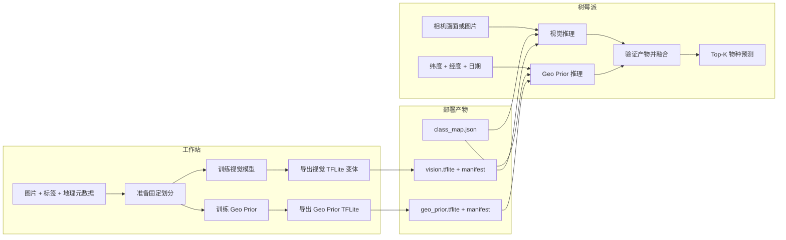

# Biodiversity Edge AI

[English](README.md) · **简体中文**

一个可在树莓派离线运行的物种识别系统。它训练图像分类模型和时空 Geo Prior，导出 TFLite 模型，评估量化，并支持相机推理。

## 快速开始

支持 Python 3.10–3.12，推荐 Python 3.12。

```bash
git clone https://github.com/winson5566/biodiversity-edge-ai.git
cd biodiversity-edge-ai
python3.12 -m venv .venv
source .venv/bin/activate
python -m pip install -e '.[train,dev]'
make smoke
```

`make smoke` 无需下载数据集。它生成 24 张合成图片，训练两个模型，导出 FP32/DRQ/全 INT8，并将对比表写入 `artifacts/smoke/results/tradeoffs.md`。

## 数据集

默认数据为 **iNaturalist 2021 Train Mini**：500,000 张图片、10,000 个物种。全量 Train 使用相同流程。

| 模式 | 下载量 | 运行命令 |
|---|---:|---|
| Mini（默认） | 42 GB 图片 + 45 MB 标注 | `make workstation` |
| 全量 Train | 224 GB 图片 + 221 MB 标注 | `make workstation DATA_SOURCE=full` |

下载默认 Mini、校验并解压到 `raw/inat2021`：

```bash
mkdir -p raw/inat2021 && cd raw/inat2021
curl -C - -O https://ml-inat-competition-datasets.s3.amazonaws.com/2021/train_mini.tar.gz
curl -C - -O https://ml-inat-competition-datasets.s3.amazonaws.com/2021/train_mini.json.tar.gz
md5sum train_mini.tar.gz train_mini.json.tar.gz
tar -xzf train_mini.tar.gz
tar -xzf train_mini.json.tar.gz
cd ../..
```

Mini 的 MD5 应为 `db6ed8330e634445efc8fec83ae81442` 和 `395a35be3651d86dc3b0d365b8ea5f92`。macOS 请将 `md5sum` 替换为 `md5`。

<details>
<summary>全部数据下载、哈希和 S3 地址</summary>

| 文件 | 大小 | MD5 | S3 地址 |
|---|---:|---|---|
| [Train Mini 图片](https://ml-inat-competition-datasets.s3.amazonaws.com/2021/train_mini.tar.gz) | 42 GB | `db6ed8330e634445efc8fec83ae81442` | `s3://ml-inat-competition-datasets/2021/train_mini.tar.gz` |
| [Train Mini 标注](https://ml-inat-competition-datasets.s3.amazonaws.com/2021/train_mini.json.tar.gz) | 45 MB | `395a35be3651d86dc3b0d365b8ea5f92` | `s3://ml-inat-competition-datasets/2021/train_mini.json.tar.gz` |
| [全量 Train 图片](https://ml-inat-competition-datasets.s3.amazonaws.com/2021/train.tar.gz) | 224 GB | `e0526d53c7f7b2e3167b2b43bb2690ed` | `s3://ml-inat-competition-datasets/2021/train.tar.gz` |
| [全量 Train 标注](https://ml-inat-competition-datasets.s3.amazonaws.com/2021/train.json.tar.gz) | 221 MB | `38a7bb733f7a09214d44293460ec0021` | `s3://ml-inat-competition-datasets/2021/train.json.tar.gz` |
| [Validation 图片](https://ml-inat-competition-datasets.s3.amazonaws.com/2021/val.tar.gz) | 8.4 GB | `f6f6e0e242e3d4c9569ba56400938afc` | `s3://ml-inat-competition-datasets/2021/val.tar.gz` |
| [Validation 标注](https://ml-inat-competition-datasets.s3.amazonaws.com/2021/val.json.tar.gz) | 9.4 MB | `4d761e0f6a86cc63e8f7afc91f6a8f0b` | `s3://ml-inat-competition-datasets/2021/val.json.tar.gz` |
| [Public Test 图片](https://ml-inat-competition-datasets.s3.amazonaws.com/2021/public_test.tar.gz) | 43 GB | `7124b949fe79bfa7f7019a15ef3dbd06` | `s3://ml-inat-competition-datasets/2021/public_test.tar.gz` |
| [Public Test 信息](https://ml-inat-competition-datasets.s3.amazonaws.com/2021/public_test.json.tar.gz) | 21 MB | `7a9413db55c6fa452824469cc7dd9d3d` | `s3://ml-inat-competition-datasets/2021/public_test.json.tar.gz` |

图片均为最长边 500 像素的 JPEG。解压后分别产生 `train_mini/category/image.jpg`、`train/category/image.jpg` 或 `val/category/image.jpg`。下载前请阅读[官方数据说明与使用条款](https://github.com/visipedia/inat_comp/tree/master/2021)。

</details>

标准流程从所选训练源中确定性地生成 70%/15%/15% 的训练、验证、测试划分。`make workstation` 不会自动使用官方下载的 Validation 或 public Test。public Test 没有标签，不能计算本地准确率。

## 训练与导出

运行完整 Mini 流程：

```bash
make workstation
```

该命令完成数据准备、MobileNetV2 和六特征 Geo Prior 训练、TFLite 导出和基准对比。

小样本可复现运行：

```bash
make workstation NUM_CLASSES=10 MAX_PER_CLASS=50 \
  DATASET=data/prepared_demo \
  MODEL_DIR=artifacts/models_demo RESULT_DIR=artifacts/results_demo
```

| 阶段 | 命令 | 主要产物 |
|---|---|---|
| 数据准备 | `make prepare` | 固定划分、元数据 CSV、`class_map.json` |
| 训练 | `make train` | `vision_baseline.keras`、`geo_prior.keras` |
| 导出 | `make export` | FP32、DRQ、INT8 和 Geo Prior TFLite |
| 对比 | `make benchmark` | JSON、CSV 和 Markdown 折中表 |

## 系统架构



融合要求类别映射哈希和输出维度一致。缺少位置或日期时，系统使用纯视觉推理。

## 评测与部署

让标准模型使用相同的保留测试图片进行评测：

```bash
make benchmark
```

比较 FP32、DRQ、全 INT8 的 Top-1、模型大小、推理耗时、端到端耗时、内存和能耗。各版本必须固定数据划分、预处理、Geo Prior、融合权重、树莓派配置、线程数、预热次数和重复次数。

识别单张图片：

```bash
PYTHONPATH=src python scripts/predict.py \
  --image /path/to/photo.jpg \
  --vision-model artifacts/models/vision_drq.tflite \
  --vision-manifest artifacts/models/vision_drq.tflite.manifest.json \
  --class-map data/prepared/class_map.json
```

树莓派相机需要安装 PiCamera2、GPIO/SPI 支持、项目的 `.[rpi]` 依赖和兼容的 TensorFlow Lite Runtime。然后运行：

```bash
PYTHONPATH=src python scripts/rpi_camera.py \
  --vision-model artifacts/models/vision_drq.tflite \
  --vision-manifest artifacts/models/vision_drq.tflite.manifest.json \
  --class-map data/prepared/class_map.json
```

追加 `--display` 使用 ST7789 屏幕；追加 `--geo-model`、`--geo-manifest`、`--latitude` 和 `--longitude` 使用 Geo Prior 融合。

## 论文硬件配置与报告结果

下列数值是报告中的参考测量结果，并非由 `make smoke` 重新生成。它们对应报告中的 EfficientNet-B0 部署；上方默认可复现流程使用的是 MobileNetV2。

### 树莓派配置

| 部件 | 配置 |
|---|---|
| 计算单元 | Raspberry Pi Zero 2 W：四核 ARM Cortex-A53，1.0 GHz，512 MB RAM；Raspberry Pi OS Lite 64-bit |
| 相机 | Raspberry Pi CSI Sony IMX219，8 MP |
| 显示器 | 1.3 英寸 Waveshare IPS LCD（ST7789） |
| 定位硬件 | L76K GPS |
| 供电 | PiSugar 3 电池管理板，1,200 mAh 单节锂离子电池 |
| 存储 | 32 GB microSD 卡 |
| 物料成本 | NZ$158，不含定制外壳和按键 |

报告的硬件配置含 GPS。当前相机命令接收固定的 `--latitude` 和 `--longitude`；本仓库尚未实现实时 GPS 读取。

### 验证集准确率

| EfficientNet-B0 版本 | 纯视觉 Top-1 | Geo 融合 Top-1（log-linear，α = 0.3） |
|---|---:|---:|
| FP32 | 73.77% | 83.26% |
| DRQ | 70.84% | 81.33% |

### Pi Zero 2 W 部署

| 版本，4 线程 | 模型大小 | 平均延迟 | 吞吐量 | 单次推理能耗 | 每瓦吞吐 | 续航 |
|---|---:|---:|---:|---:|---:|---:|
| FP32 | 64.07 MB | 753.08 ms | 1.33 FPS | 1,127.8 mJ | 0.89 FPS/W | 4.68 h |
| DRQ | 16.15 MB | 461.50 ms | 2.17 FPS | 691.2 mJ | 1.45 FPS/W | 4.55 h |

延迟、吞吐和能耗使用 4 个推理线程，设备净功耗为 1.5 W。续航以每 30 秒一次采集–推理–显示周期计算。

## 验证

运行完整的生成数据检查：`make smoke`；运行单元测试：`make test`。
